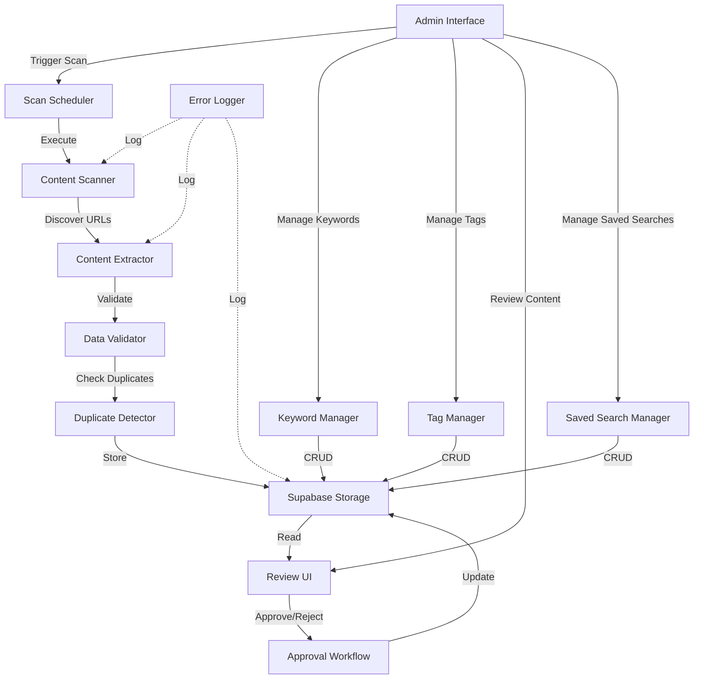

# Design Document: Automated Data Collection

## Overview

The Automated Data Collection system is a content discovery and curation platform for UFO-related information. It automatically scans internet sources using configurable keywords and tag filters, extracts structured data, stores it in Supabase, and provides an admin review workflow before publication.

The system consists of three main subsystems:

1. **Content Discovery Engine**: Scans internet sources using keywords and hierarchical tag filters, extracts structured data, and detects duplicates
2. **Data Storage Layer**: Supabase database with tables for review queue, approved content, keywords, tags, search history, and saved searches
3. **Admin Interface**: Web UI for reviewing content, managing keywords/tags, triggering scans with tag filtering, and managing saved searches with versioning

Key design principles:

- **Separation of concerns**: Scanner, extractor, storage, and UI are independent components
- **Idempotency**: Duplicate detection prevents the same content from being stored multiple times
- **Auditability**: Search history tracks all scan executions with specific tag values and saved search references
- **Flexibility**: Hierarchical tag system allows precise filtering; saved searches enable reusable configurations
- **Resilience**: Retry logic, error logging, and timeout handling ensure robust operation

## Architecture

### System Components



### Component Responsibilities

**Content Scanner**
- Retrieves active keywords and selected tag filters from configuration
- Searches internet sources (web scraping, APIs, RSS feeds)
- Records search execution in Search_History with specific tag_ids
- Passes discovered URLs to Content Extractor
- Handles network errors and timeouts

**Content Extractor**
- Fetches HTML from discovered URLs
- Extracts structured data: title, description, date, content type
- Classifies content as event, person, theory, or news
- Stores raw HTML for admin reference
- Passes extracted data to Data Validator

**Data Validator**
- Validates required fields (title, source_url)
- Validates content_type enum
- Validates date format (ISO 8601)
- Rejects invalid content with error logging

**Duplicate Detector**
- Checks if source_url exists in Review_Queue or Timeline_Archive
- Calculates title similarity using Levenshtein distance
- Flags potential duplicates (>90% similarity)
- Prevents duplicate storage

**Supabase Storage**
- Manages database connections and transactions
- Implements retry logic with exponential backoff
- Provides CRUD operations for all tables
- Enforces foreign key constraints

**Scan Scheduler**
- Executes scans at configurable intervals
- Prevents overlapping scans for same keyword
- Enforces 30-minute timeout per scan
- Updates last_scan_at timestamps

**Admin Interface**
- Displays UFO Atlas logo in header
- Provides review queue with approve/reject actions
- Manages keywords (add, activate, deactivate)
- Manages tags hierarchically (Tag_Groups with expandable Tags)
- Provides manual scan trigger with tag filtering UI
- Manages saved searches with versioning
- Displays search history and error logs

**Approval Workflow**
- Copies approved content from Review_Queue to Timeline_Archive
- Updates status and timestamps
- Records admin user_id for audit trail
- Preserves tag assignments

**Tag Manager**
- Creates and edits Tags within Tag_Groups
- Assigns Tags to Content_Items
- Prevents deletion of Tags in use
- Displays hierarchical tag structure

**Saved Search Manager**
- Creates new saved searches with version 1
- Refines existing searches (creates new version with parent_search_id)
- Executes saved searches and records in Search_History
- Displays version history
- Deletes saved searches while preserving history

**Error Logger**
- Logs all errors with timestamp, component, message, stack trace
- Logs scan executions with metrics
- Logs database operations with execution time
- Provides admin UI for log review

### Technology Stack

- **Database**: Supabase (PostgreSQL)
- **Backend**: Node.js with TypeScript
- **Web Scraping**: Puppeteer or Cheerio
- **HTTP Client**: Axios with retry logic
- **Scheduling**: node-cron or Bull queue
- **Frontend**: React with TypeScript
- **UI Framework**: Tailwind CSS or Material-UI
- **String Similarity**: fast-levenshtein library

## Components and Interfaces

### Content Scanner Interface

```typescript
interface ContentScanner {
  /**
   * Execute a scan job with specified keywords and tag filters
   * @param keywords - Array of keyword strings to search
   * @param tagIds - Array of specific tag IDs to filter by (empty = all tags in group)
   * @param savedSearchId - Optional saved search ID for tracking
   * @param savedSearchVersion - Optional saved search version
   * @returns Scan job result with discovered URLs
   */
  executeScan(
    keywords: string[],
    tagIds: number[],
    savedSearchId?: number,
    savedSearchVersion?: number
  ): Promise<ScanResult>;
  
  /**
   * Get active keywords from configuration
   */
  getActiveKeywords(): Promise<string[]>;
}

interface ScanResult {
  scanJobId: string;
  discoveredUrls: string[];
  searchTimestamp: Date;
  keywordsUsed: string[];
  selectedTagIds: number[];
  errorCount: number;
}
```

### Content Extractor Interface

```typescript
interface ContentExtractor {
  /**
   * Extract structured data from a URL
   * @param url - Source URL to extract from
   * @returns Extracted content item or null if extraction fails
   */
  extract(url: string): Promise<ExtractedContent | null>;
}

interface ExtractedContent {
  title: string;
  description: string;
  eventDate: Date | null;
  sourceUrl: string;
  contentType: 'event' | 'person' | 'theory' | 'news';
  rawHtml: string;
}
```

### Data Validator Interface

```typescript
interface DataValidator {
  /**
   * Validate extracted content
   * @param content - Extracted content to validate
   * @returns Validation result with errors if any
   */
  validate(content: ExtractedContent): ValidationResult;
}

interface ValidationResult {
  isValid: boolean;
  errors: string[];
}
```

### Duplicate Detector Interface

```typescript
interface DuplicateDetector {
  /**
   * Check if content is a duplicate
   * @param content - Content to check
   * @returns Duplicate check result
   */
  checkDuplicate(content: ExtractedContent): Promise<DuplicateCheckResult>;
}

interface DuplicateCheckResult {
  isDuplicate: boolean;
  isPotentialDuplicate: boolean;
  matchedContentId?: number;
  similarityScore?: number;
}
```

### Storage Interface

```typescript
interface StorageService {
  /**
   * Insert content into review queue
   */
  insertReviewQueue(content: ExtractedContent, isPotentialDuplicate: boolean): Promise<number>;
  
  /**
   * Approve content and move to timeline archive
   */
  approveContent(contentId: number, adminUserId: string): Promise<void>;
  
  /**
   * Reject content
   */
  rejectContent(contentId: number, adminUserId: string): Promise<void>;
  
  /**
   * Get pending content from review queue
   */
  getPendingContent(filters?: ContentFilters): Promise<ContentItem[]>;
  
  /**
   * Manage keywords
   */
  addKeyword(keyword: string): Promise<number>;
  activateKeyword(keywordId: number): Promise<void>;
  deactivateKeyword(keywordId: number): Promise<void>;
  getActiveKeywords(): Promise<Keyword[]>;
  
  /**
   * Manage tags
   */
  createTag(tagName: string, tagGroupId: number): Promise<number>;
  updateTag(tagId: number, tagName: string): Promise<void>;
  deleteTag(tagId: number): Promise<void>;
  getTagsByGroup(tagGroupId: number): Promise<Tag[]>;
  assignTagsToContent(contentId: number, tagIds: number[]): Promise<void>;
  
  /**
   * Record search history
   */
  recordSearchHistory(
    scanJobId: string,
    keywordsUsed: string[],
    selectedTagIds: number[],
    savedSearchId?: number,
    savedSearchVersion?: number
  ): Promise<number>;
  
  /**
   * Manage saved searches
   */
  createSavedSearch(
    searchName: string,
    keywordsUsed: string[],
    selectedTagIds: number[],
    createdBy: string,
    parentSearchId?: number
  ): Promise<SavedSearch>;
  getSavedSearches(): Promise<SavedSearch[]>;
  getSavedSearchVersions(searchName: string): Promise<SavedSearch[]>;
  deleteSavedSearch(savedSearchId: number): Promise<void>;
}

interface ContentFilters {
  contentType?: 'event' | 'person' | 'theory' | 'news';
  tagIds?: number[];
}

interface ContentItem {
  contentId: number;
  title: string;
  description: string;
  eventDate: Date | null;
  sourceUrl: string;
  contentType: string;
  rawHtml: string;
  discoveredAt: Date;
  status: string;
  isPotentialDuplicate: boolean;
  tags: Tag[];
}

interface Keyword {
  keywordId: number;
  keywordText: string;
  isActive: boolean;
  lastScanAt: Date | null;
}

interface Tag {
  tagId: number;
  tagName: string;
  tagGroupId: number;
  tagGroupName: string;
  createdAt: Date;
}

interface SavedSearch {
  savedSearchId: number;
  searchName: string;
  version: number;
  keywordsUsed: string[];
  selectedTagIds: number[];
  createdAt: Date;
  createdBy: string;
  parentSearchId: number | null;
}
```

### Admin Interface API

```typescript
interface AdminAPI {
  /**
   * Trigger manual scan with tag filtering
   */
  triggerScan(tagIds: number[], savedSearchId?: number): Promise<ScanResult>;
  
  /**
   * Get review queue
   */
  getReviewQueue(filters?: ContentFilters): Promise<ContentItem[]>;
  
  /**
   * Approve content
   */
  approveContent(contentId: number): Promise<void>;
  
  /**
   * Reject content
   */
  rejectContent(contentId: number): Promise<void>;
  
  /**
   * Keyword management
   */
  addKeyword(keyword: string): Promise<void>;
  toggleKeyword(keywordId: number, isActive: boolean): Promise<void>;
  getKeywords(): Promise<Keyword[]>;
  
  /**
   * Tag management
   */
  createTag(tagName: string, tagGroupId: number): Promise<void>;
  updateTag(tagId: number, tagName: string): Promise<void>;
  deleteTag(tagId: number): Promise<void>;
  getTagGroups(): Promise<TagGroup[]>;
  assignTags(contentId: number, tagIds: number[]): Promise<void>;
  
  /**
   * Saved search management
   */
  saveSear(
    searchName: string,
    keywordsUsed: string[],
    selectedTagIds: number[]
  ): Promise<SavedSearch>;
  refineSavedSearch(
    parentSearchId: number,
    searchName: string,
    keywordsUsed: string[],
    selectedTagIds: number[]
  ): Promise<SavedSearch>;
  getSavedSearches(): Promise<SavedSearch[]>;
  executeSavedSearch(savedSearchId: number): Promise<ScanResult>;
  deleteSavedSearch(savedSearchId: number): Promise<void>;
  
  /**
   * Get error logs
   */
  getErrorLogs(limit?: number): Promise<ErrorLog[]>;
  
  /**
   * Get search history
   */
  getSearchHistory(limit?: number): Promise<SearchHistoryEntry[]>;
}

interface TagGroup {
  tagGroupId: number;
  groupName: string;
  tags: Tag[];
}

interface ErrorLog {
  logId: number;
  timestamp: Date;
  component: string;
  message: string;
  stackTrace: string;
}

interface SearchHistoryEntry {
  searchId: number;
  scanJobId: string;
  searchTimestamp: Date;
  keywordsUsed: string[];
  selectedTagIds: number[];
  savedSearchId: number | null;
  savedSearchVersion: number | null;
  itemsDiscovered: number;
}
```

## Data Models

### Database Schema

```sql
-- Tag Groups (hierarchical categories)
CREATE TABLE Tag_Groups (
  tag_group_id SERIAL PRIMARY KEY,
  group_name VARCHAR(100) NOT NULL UNIQUE,
  created_at TIMESTAMP DEFAULT NOW()
);

-- Tags (specific values within Tag_Groups)
CREATE TABLE Tags (
  tag_id SERIAL PRIMARY KEY,
  tag_name VARCHAR(100) NOT NULL,
  tag_group_id INTEGER NOT NULL REFERENCES Tag_Groups(tag_group_id),
  created_at TIMESTAMP DEFAULT NOW(),
  UNIQUE(tag_name, tag_group_id)
);

-- Review Queue (pending content)
CREATE TABLE Review_Queue (
  content_id SERIAL PRIMARY KEY,
  title VARCHAR(500) NOT NULL,
  description TEXT,
  event_date DATE,
  source_url VARCHAR(1000) NOT NULL UNIQUE,
  content_type VARCHAR(20) NOT NULL CHECK (content_type IN ('event', 'person', 'theory', 'news')),
  raw_html TEXT,
  discovered_at TIMESTAMP DEFAULT NOW(),
  status VARCHAR(20) DEFAULT 'pending' CHECK (status IN ('pending', 'approved', 'rejected')),
  is_potential_duplicate BOOLEAN DEFAULT FALSE,
  approved_at TIMESTAMP,
  rejected_at TIMESTAMP,
  reviewed_by VARCHAR(100)
);

-- Timeline Archive (approved content)
CREATE TABLE Timeline_Archive (
  content_id SERIAL PRIMARY KEY,
  title VARCHAR(500) NOT NULL,
  description TEXT,
  event_date DATE,
  source_url VARCHAR(1000) NOT NULL UNIQUE,
  content_type VARCHAR(20) NOT NULL CHECK (content_type IN ('event', 'person', 'theory', 'news')),
  approved_at TIMESTAMP DEFAULT NOW(),
  approved_by VARCHAR(100) NOT NULL
);

-- Keyword Configuration
CREATE TABLE Keyword_Config (
  keyword_id SERIAL PRIMARY KEY,
  keyword_text VARCHAR(200) NOT NULL UNIQUE,
  is_active BOOLEAN DEFAULT TRUE,
  last_scan_at TIMESTAMP
);

-- Content Tags (many-to-many relationship)
CREATE TABLE Content_Tags (
  content_id INTEGER NOT NULL,
  tag_id INTEGER NOT NULL REFERENCES Tags(tag_id),
  assigned_at TIMESTAMP DEFAULT NOW(),
  table_name VARCHAR(50) NOT NULL CHECK (table_name IN ('Review_Queue', 'Timeline_Archive')),
  PRIMARY KEY (content_id, tag_id, table_name)
);

-- Saved Searches (reusable search configurations with versioning)
CREATE TABLE Saved_Searches (
  saved_search_id SERIAL PRIMARY KEY,
  search_name VARCHAR(200) NOT NULL,
  version INTEGER NOT NULL DEFAULT 1,
  keywords_used TEXT[] NOT NULL,
  selected_tag_ids INTEGER[] NOT NULL,
  created_at TIMESTAMP DEFAULT NOW(),
  created_by VARCHAR(100) NOT NULL,
  parent_search_id INTEGER REFERENCES Saved_Searches(saved_search_id),
  UNIQUE(search_name, version)
);

-- Search History (audit trail of all scans)
CREATE TABLE Search_History (
  search_id SERIAL PRIMARY KEY,
  scan_job_id VARCHAR(100) NOT NULL,
  search_timestamp TIMESTAMP DEFAULT NOW(),
  keywords_used TEXT[] NOT NULL,
  selected_tag_ids INTEGER[] NOT NULL,
  saved_search_id INTEGER REFERENCES Saved_Searches(saved_search_id),
  saved_search_version INTEGER,
  items_discovered INTEGER DEFAULT 0
);

-- Error Logs
CREATE TABLE Error_Logs (
  log_id SERIAL PRIMARY KEY,
  timestamp TIMESTAMP DEFAULT NOW(),
  component VARCHAR(100) NOT NULL,
  message TEXT NOT NULL,
  stack_trace TEXT,
  scan_job_id VARCHAR(100)
);

-- Indexes for performance
CREATE INDEX idx_review_queue_status ON Review_Queue(status);
CREATE INDEX idx_review_queue_discovered_at ON Review_Queue(discovered_at DESC);
CREATE INDEX idx_timeline_archive_event_date ON Timeline_Archive(event_date);
CREATE INDEX idx_content_tags_tag_id ON Content_Tags(tag_id);
CREATE INDEX idx_tags_tag_group_id ON Tags(tag_group_id);
CREATE INDEX idx_search_history_timestamp ON Search_History(search_timestamp DESC);
CREATE INDEX idx_search_history_saved_search ON Search_History(saved_search_id, saved_search_version);
CREATE INDEX idx_saved_searches_name ON Saved_Searches(search_name);
```

### Entity Relationships

```mermaid
erDiagram
    Tag_Groups ||--o{ Tags : contains
    Tags ||--o{ Content_Tags : "assigned to"
    Review_Queue ||--o{ Content_Tags : "has tags"
    Timeline_Archive ||--o{ Content_Tags : "has tags"
    Saved_Searches ||--o{ Search_History : "executed as"
    Saved_Searches ||--o{ Saved_Searches : "refined from"
    
    Tag_Groups {
        int tag_group_id PK
        string group_name
        timestamp created_at
    }
    
    Tags {
        int tag_id PK
        string tag_name
        int tag_group_id FK
        timestamp created_at
    }
    
    Review_Queue {
        int content_id PK
        string title
        text description
        date event_date
        string source_url
        string content_type
        text raw_html
        timestamp discovered_at
        string status
        boolean is_potential_duplicate
    }
    
    Timeline_Archive {
        int content_id PK
        string title
        text description
        date event_date
        string source_url
        string content_type
        timestamp approved_at
        string approved_by
    }
    
    Content_Tags {
        int content_id FK
        int tag_id FK
        string table_name
        timestamp assigned_at
    }
    
    Saved_Searches {
        int saved_search_id PK
        string search_name
        int version
        array keywords_used
        array selected_tag_ids
        timestamp created_at
        string created_by
        int parent_search_id FK
    }
    
    Search_History {
        int search_id PK
        string scan_job_id
        timestamp search_timestamp
        array keywords_used
        array selected_tag_ids
        int saved_search_id FK
        int saved_search_version
        int items_discovered
    }
```



### Data Flow

1. **Scan Execution Flow**:
   - Admin triggers scan with selected tag IDs (or empty for "all")
   - Scanner retrieves active keywords from Keyword_Config
   - Scanner searches internet sources using keywords + tag filters
   - Scanner records search in Search_History with specific tag_ids
   - Discovered URLs passed to Extractor

2. **Content Processing Flow**:
   - Extractor fetches HTML and extracts structured data
   - Validator checks required fields and formats
   - Duplicate Detector checks source_url and title similarity
   - Valid, non-duplicate content inserted into Review_Queue
   - Potential duplicates flagged with is_potential_duplicate = true

3. **Approval Flow**:
   - Admin reviews content in Review_Queue
   - Admin assigns tags to content via Content_Tags
   - On approval: content copied to Timeline_Archive with tags
   - Review_Queue status updated to 'approved'
   - Admin user_id recorded for audit

4. **Saved Search Flow**:
   - Admin configures search with keywords and tag filters
   - Admin saves search with custom name (version 1 created)
   - Admin can execute saved search (recorded in Search_History)
   - Admin can refine saved search (new version with parent_search_id)
   - Version history preserved for audit


## Correctness Properties

A property is a characteristic or behavior that should hold true across all valid executions of a system-essentially, a formal statement about what the system should do. Properties serve as the bridge between human-readable specifications and machine-verifiable correctness guarantees.

### Property 1: Active Keyword Retrieval

For any database state, when the Content_Scanner retrieves keywords, it should only return keywords where is_active = true.

**Validates: Requirements 1.1**

### Property 2: Complete Keyword Coverage

For any set of active keywords in Keyword_Config, when a Scan_Job is triggered, the Content_Scanner should search using all active keywords.

**Validates: Requirements 1.2**

### Property 3: Scan Metadata Recording

For any Scan_Job execution, the Search_History table should contain a record with scan_job_id, search_timestamp, keywords_used, and selected_tag_ids populated.

**Validates: Requirements 1.3, 1.4, 1.5, 3.10**

### Property 4: Default Tag Group Expansion

For any Tag_Group where no specific Tags are selected, the system should search using all tag_ids from that Tag_Group and record all those tag_ids in Search_History.

**Validates: Requirements 1.6, 3.11, 8.4**

### Property 5: Scan Completion Logging

For any completed Scan_Job, there should exist a log entry or Search_History record with items_discovered count populated.

**Validates: Requirements 1.7**

### Property 6: Scan Error Resilience

For any Scan_Job where one keyword fails, the Content_Scanner should continue processing remaining keywords and log the error for the failed keyword.

**Validates: Requirements 1.8**

### Property 7: Content Extraction Completeness

For any valid HTML source, the Content_Extractor should return an ExtractedContent object containing title, description, eventDate, sourceUrl, contentType, and rawHtml fields.

**Validates: Requirements 2.1, 2.5**

### Property 8: Content Type Classification

For any extracted content, the contentType field should be one of: 'event', 'person', 'theory', or 'news'.

**Validates: Requirements 2.2, 10.4**

### Property 9: Date Format Standardization

For any extracted content where date information is available, the eventDate should be in ISO 8601 format.

**Validates: Requirements 2.3**

### Property 10: Extraction Error Handling

For any source where extraction fails, the Content_Extractor should log the failure and not insert the content into Review_Queue.

**Validates: Requirements 2.4**

### Property 11: Database Schema Integrity

For any record inserted into Review_Queue, Timeline_Archive, Keyword_Config, Tag_Groups, Tags, Content_Tags, Search_History, or Saved_Searches, all required fields for that table should be populated according to the schema definition.

**Validates: Requirements 3.2, 3.3, 3.4, 3.5, 3.6, 3.7, 3.8, 3.9, 11.6**

### Property 12: Pending Status on Insertion

For any valid extracted content inserted into Review_Queue, the status field should be set to 'pending'.

**Validates: Requirements 3.1**

### Property 13: Saved Search History Linkage

For any Scan_Job executed from a Saved_Search, the Search_History record should contain the saved_search_id and saved_search_version.

**Validates: Requirements 3.12, 12.6**

### Property 14: Database Retry Logic

For any database write operation that fails, the system should retry up to 3 times with exponential backoff before giving up.

**Validates: Requirements 3.13**

### Property 15: Pending Content Display

For any set of Content_Items with status = 'pending' in Review_Queue, the Admin_Interface should display all of them.

**Validates: Requirements 4.2**

### Property 16: Content Field Display Completeness

For any Content_Item displayed in the Admin_Interface, the UI should show title, description, event_date, source_url, content_type, and raw_html.

**Validates: Requirements 4.3**

### Property 17: Action Button Availability

For any Content_Item displayed in the review queue, the Admin_Interface should provide both "Approve" and "Reject" action buttons.

**Validates: Requirements 4.4**

### Property 18: Chronological Ordering

For any list of Content_Items displayed in the Admin_Interface, they should be ordered by discovered_at in descending order (newest first).

**Validates: Requirements 4.5**

### Property 19: Content Type Filtering

For any content_type filter applied in the Admin_Interface, only Content_Items with that content_type should be displayed.

**Validates: Requirements 4.6**

### Property 20: Hierarchical Tag UI Structure

For any set of Tag_Groups and Tags, the Admin_Interface should display Tag_Groups as expandable sections, and when expanded, show all Tags within that group with checkboxes.

**Validates: Requirements 4.7, 8.2, 8.3**

### Property 21: Approval Data Transfer

For any Content_Item that is approved, the system should create a corresponding record in Timeline_Archive with the same title, description, event_date, source_url, and content_type, and update the Review_Queue status to 'approved' with approved_at timestamp.

**Validates: Requirements 5.1, 5.2**

### Property 22: Rejection Status Update

For any Content_Item that is rejected, the Review_Queue record should have status = 'rejected' and rejected_at timestamp populated.

**Validates: Requirements 5.3**

### Property 23: Admin Action Attribution

For any approve or reject action, the reviewed_by field should contain the admin's user_id.

**Validates: Requirements 5.4**

### Property 24: Approved Content Availability

For any Content_Item that has been approved, querying Timeline_Archive should return that content.

**Validates: Requirements 5.5**

### Property 25: Keyword Addition

For any new keyword text, calling the add keyword function should result in a new record in Keyword_Config with that keyword_text.

**Validates: Requirements 6.1**

### Property 26: Keyword Activation Toggle

For any keyword in Keyword_Config, toggling its activation status should update the is_active field accordingly.

**Validates: Requirements 6.2**

### Property 27: Deactivated Keyword Exclusion

For any keyword where is_active = false, future Scan_Jobs should not include that keyword in their searches.

**Validates: Requirements 6.4**

### Property 28: Keyword Uniqueness

For any keyword_text, there should be at most one record in Keyword_Config with that keyword_text.

**Validates: Requirements 6.5**

### Property 29: Source URL Duplicate Detection

For any Content_Item being stored, if the source_url already exists in Review_Queue or Timeline_Archive, the system should skip storing it and log the duplicate occurrence.

**Validates: Requirements 7.1, 7.2**

### Property 30: Title Similarity Detection

For any Content_Item with a source_url that doesn't exist but has a title with >90% similarity to an existing title, the system should flag it with is_potential_duplicate = true.

**Validates: Requirements 7.3, 7.4**

### Property 31: Duplicate Highlighting

For any Content_Item where is_potential_duplicate = true, the Admin_Interface should visually highlight it.

**Validates: Requirements 7.5**

### Property 32: Tag Filter Application

For any set of selected tag_ids, when a Scan_Job is triggered, the Content_Scanner should search only for content matching those specific tag values.

**Validates: Requirements 8.5**

### Property 33: Manual Scan Execution

For any manual scan trigger via the Admin_Interface, the system should immediately execute a Scan_Job using all active keywords and the selected tag_ids.

**Validates: Requirements 8.6**

### Property 34: Search Configuration Persistence

For any search configuration saved via the Admin_Interface, a Saved_Search record should be created with the search_name, keywords_used, and selected_tag_ids.

**Validates: Requirements 8.7, 12.1**

### Property 35: Scan Scheduling

For any configured scan interval, Scan_Jobs should execute at that interval automatically.

**Validates: Requirements 8.8**

### Property 36: Scan Concurrency Control

For any keyword, there should be at most one active Scan_Job processing that keyword at any given time.

**Validates: Requirements 8.9**

### Property 37: Scan Timestamp Update

For any Scan_Job that starts, all keywords used in that scan should have their last_scan_at timestamp updated.

**Validates: Requirements 8.10**

### Property 38: Scan Timeout Enforcement

For any Scan_Job that runs longer than 30 minutes, the system should terminate it and log a timeout error.

**Validates: Requirements 8.11**

### Property 39: Error Logging Completeness

For any error encountered by any component, the Error_Logs table should contain a record with timestamp, component name, error message, and stack trace.

**Validates: Requirements 9.1**

### Property 40: Scan Execution Logging

For any Scan_Job execution, there should be a log entry or Search_History record with start time, end time, and items_discovered.

**Validates: Requirements 9.2**

### Property 41: Network Error Logging

For any failed network request, the Error_Logs table should contain a record with the URL, status code, and error message.

**Validates: Requirements 9.4**

### Property 42: Required Field Validation

For any content submitted to the Content_Extractor, if title or source_url is missing, validation should fail and the content should not be stored.

**Validates: Requirements 10.1, 10.2, 10.3**

### Property 43: Date Format Validation

For any content with an event_date field, the date should be in a valid date format.

**Validates: Requirements 10.5**

### Property 44: Tag Creation and Assignment

For any new tag with tag_name and tag_group_id, calling the create tag function should insert a record into the Tags table with those values.

**Validates: Requirements 11.7**

### Property 45: Content Tag Assignment

For any Content_Item and set of tag_ids, calling the assign tags function should create Content_Tags records linking that content_id to each tag_id.

**Validates: Requirements 11.8**

### Property 46: Tag-Based Content Filtering

For any set of tag_ids used as a filter, the Admin_Interface should only display Content_Items that have at least one of those tags assigned.

**Validates: Requirements 11.10**

### Property 47: Tag Preservation on Approval

For any Content_Item with assigned tags that is approved, all Content_Tags records should be preserved with the Timeline_Archive content_id.

**Validates: Requirements 11.11**

### Property 48: Tag Deletion Protection

For any tag that has Content_Tags records referencing it, deletion attempts should fail.

**Validates: Requirements 11.14**

### Property 49: Initial Saved Search Versioning

For any new saved search created for the first time, the version field should be set to 1.

**Validates: Requirements 12.2**

### Property 50: Saved Search Display

For any set of Saved_Searches in the database, the Admin_Interface should display them with search_name and version.

**Validates: Requirements 4.9, 12.3**

### Property 51: Saved Search Configuration Loading

For any Saved_Search selected in the Admin_Interface, the UI should populate the keyword and tag filter fields with the values from that saved search.

**Validates: Requirements 12.4**

### Property 52: Saved Search Execution

For any Saved_Search, executing it should trigger a Scan_Job with the keywords_used and selected_tag_ids from that saved search.

**Validates: Requirements 12.5**

### Property 53: Saved Search Refinement Versioning

For any Saved_Search that is refined and saved, a new Saved_Search record should be created with version incremented by 1 and parent_search_id set to the original saved_search_id.

**Validates: Requirements 12.8**

### Property 54: Saved Search Version Preservation

For any Saved_Search with multiple versions, all version records should remain in the Saved_Searches table.

**Validates: Requirements 12.9**

### Property 55: Fire and Forget Execution

For any scan executed as "fire and forget", no Saved_Search record should be created.

**Validates: Requirements 12.11**

### Property 56: Saved Search Deletion with History Preservation

For any Saved_Search that is deleted, all Search_History records referencing that saved_search_id should remain in the database.

**Validates: Requirements 12.14**

## Error Handling

### Error Categories

1. **Network Errors**
   - Connection timeouts
   - DNS resolution failures
   - HTTP error responses (4xx, 5xx)
   - Rate limiting (429)

2. **Extraction Errors**
   - Malformed HTML
   - Missing required fields
   - Invalid date formats
   - Unsupported content types

3. **Database Errors**
   - Connection failures
   - Constraint violations
   - Transaction deadlocks
   - Query timeouts

4. **Validation Errors**
   - Missing required fields
   - Invalid URL formats
   - Invalid enum values
   - Date parsing failures

5. **Concurrency Errors**
   - Overlapping scan jobs
   - Race conditions in duplicate detection
   - Lock timeouts

### Error Handling Strategies

**Network Errors**
- Retry with exponential backoff (3 attempts)
- Log URL, status code, and error message
- Continue with remaining URLs
- Respect rate limits with delay

**Extraction Errors**
- Log source URL and error details
- Store raw HTML for manual review
- Skip to next source
- Flag for admin attention if pattern detected

**Database Errors**
- Retry with exponential backoff (3 attempts)
- Use transactions for multi-step operations
- Log query type and execution time
- Alert on repeated failures

**Validation Errors**
- Log validation failure with field details
- Skip invalid content
- Provide clear error messages in admin UI
- Track validation failure rates

**Concurrency Errors**
- Use database locks for critical sections
- Implement idempotent operations
- Queue overlapping scans for later execution
- Log concurrency conflicts

### Error Recovery

**Scan Job Failures**
- Mark scan as failed in Search_History
- Update keyword last_scan_at even on failure
- Allow manual retry from admin UI
- Preserve partial results

**Database Connection Loss**
- Implement connection pooling with health checks
- Automatic reconnection with backoff
- Queue operations during outage
- Alert on extended outages

**Timeout Handling**
- 30-minute timeout per scan job
- 10-second timeout per HTTP request
- 5-second timeout per database query
- Graceful shutdown on timeout

## Testing Strategy

### Unit Testing

Unit tests will focus on specific examples, edge cases, and error conditions for individual components:

**Content Scanner**
- Test keyword retrieval with various database states
- Test scan execution with empty keyword list
- Test error handling for network failures
- Test timeout enforcement

**Content Extractor**
- Test extraction with well-formed HTML
- Test extraction with missing fields
- Test date parsing with various formats
- Test content type classification logic

**Data Validator**
- Test validation with valid content
- Test validation with missing required fields
- Test validation with invalid URLs
- Test validation with invalid dates

**Duplicate Detector**
- Test exact URL match detection
- Test title similarity calculation
- Test edge cases (empty titles, very long titles)
- Test performance with large datasets

**Storage Service**
- Test CRUD operations for all tables
- Test transaction rollback on errors
- Test foreign key constraint enforcement
- Test retry logic with simulated failures

**Admin Interface**
- Test UI rendering with various data states
- Test button click handlers
- Test form validation
- Test error message display

### Property-Based Testing

Property-based tests will verify universal properties across all inputs using a PBT library (fast-check for TypeScript/JavaScript). Each test will run a minimum of 100 iterations with randomly generated inputs.

**Test Configuration**
- Library: fast-check (npm package)
- Iterations per test: 100 minimum
- Seed: Random (logged for reproducibility)
- Shrinking: Enabled for minimal failing examples

**Property Test Examples**

```typescript
// Feature: automated-data-collection, Property 1: Active Keyword Retrieval
test('scanner retrieves only active keywords', async () => {
  await fc.assert(
    fc.asyncProperty(
      fc.array(fc.record({
        keyword_text: fc.string(),
        is_active: fc.boolean()
      })),
      async (keywords) => {
        // Setup: Insert keywords into database
        await setupKeywords(keywords);
        
        // Execute: Retrieve active keywords
        const activeKeywords = await scanner.getActiveKeywords();
        
        // Verify: All returned keywords have is_active = true
        const expectedActive = keywords.filter(k => k.is_active);
        expect(activeKeywords).toHaveLength(expectedActive.length);
        activeKeywords.forEach(k => {
          expect(k.is_active).toBe(true);
        });
      }
    ),
    { numRuns: 100 }
  );
});

// Feature: automated-data-collection, Property 28: Keyword Uniqueness
test('keyword text is unique in database', async () => {
  await fc.assert(
    fc.asyncProperty(
      fc.string({ minLength: 1 }),
      async (keywordText) => {
        // Execute: Add keyword twice
        await storage.addKeyword(keywordText);
        
        // Verify: Second add should fail or be idempotent
        await expect(storage.addKeyword(keywordText)).rejects.toThrow();
        
        // Verify: Only one record exists
        const keywords = await storage.getKeywords();
        const matches = keywords.filter(k => k.keyword_text === keywordText);
        expect(matches).toHaveLength(1);
      }
    ),
    { numRuns: 100 }
  );
});

// Feature: automated-data-collection, Property 30: Title Similarity Detection
test('similar titles are flagged as potential duplicates', async () => {
  await fc.assert(
    fc.asyncProperty(
      fc.record({
        title: fc.string({ minLength: 10 }),
        source_url: fc.webUrl()
      }),
      async (content) => {
        // Setup: Store original content
        await storage.insertReviewQueue(content, false);
        
        // Execute: Create similar title (change 1 character)
        const similarTitle = content.title.substring(0, content.title.length - 1) + 'X';
        const similarContent = {
          ...content,
          title: similarTitle,
          source_url: content.source_url + '/different'
        };
        
        const dupCheck = await duplicateDetector.checkDuplicate(similarContent);
        
        // Verify: If similarity > 90%, should be flagged
        const similarity = calculateSimilarity(content.title, similarTitle);
        if (similarity > 0.9) {
          expect(dupCheck.isPotentialDuplicate).toBe(true);
        }
      }
    ),
    { numRuns: 100 }
  );
});
```

**Property Test Coverage**

All 56 correctness properties will be implemented as property-based tests. Each test will:
- Generate random valid inputs using fast-check generators
- Execute the system operation
- Verify the property holds for all generated inputs
- Tag the test with the property number and text

**Integration Testing**

Integration tests will verify end-to-end workflows:
- Complete scan execution from trigger to storage
- Approval workflow from review queue to timeline archive
- Saved search creation, refinement, and execution
- Tag assignment and filtering across components

**Performance Testing**

- Scan performance with 1000+ keywords
- Duplicate detection with 100,000+ existing records
- UI responsiveness with 10,000+ pending items
- Database query performance under load

**Manual Testing**

- Admin UI usability and visual design
- UFO Atlas logo display and branding
- Tag group expansion and checkbox interactions
- Error message clarity and helpfulness

