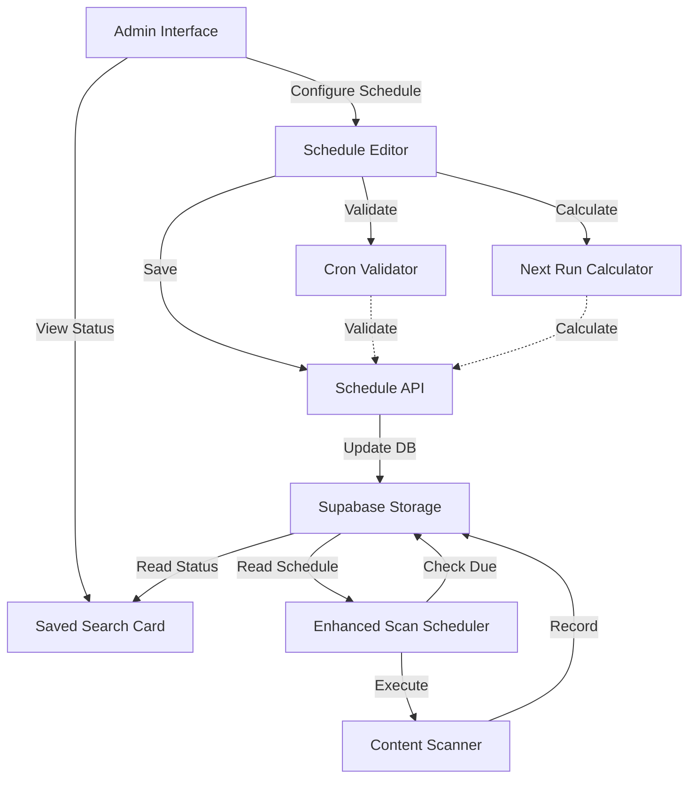
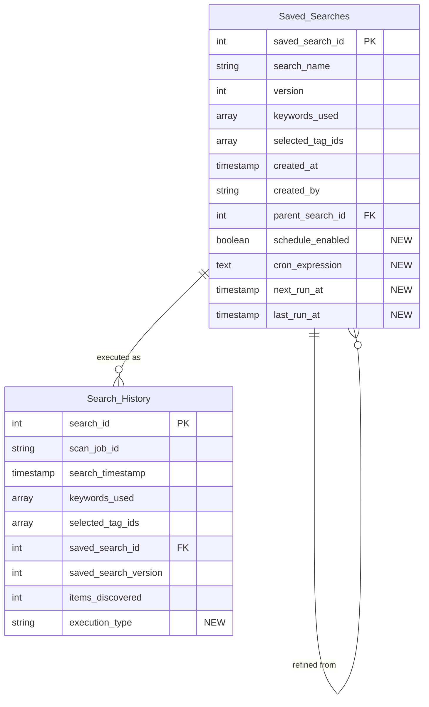

# Design Document: Saved Search Scheduling

## Overview

The Saved Search Scheduling feature extends the existing automated-data-collection system to enable administrators to schedule automated execution of saved searches using cron-based scheduling. This feature transforms saved searches from manually-triggered operations into fully automated recurring tasks.

The system integrates with the existing ScanScheduler, ContentScanner, and database infrastructure to provide:

1. **Schedule Configuration**: Admins can configure cron expressions for any saved search with a minimum 15-minute interval enforcement
2. **Schedule Management**: Enable/disable scheduling without losing configuration, with real-time next execution preview
3. **Automated Execution**: Scheduled searches execute automatically using the same logic as manual execution
4. **Execution Tracking**: Distinguish between manual and scheduled executions in search history
5. **Status Visibility**: Clear visual indicators showing scheduling status and next run times

Key design principles:

- **Minimal Schema Changes**: Extends Saved_Searches and Search_History tables with scheduling fields
- **Reuse Existing Components**: Leverages existing ContentScanner and ScanScheduler infrastructure
- **Separation of Concerns**: Schedule management is independent of scan execution logic
- **Validation at Multiple Layers**: Client-side and server-side cron validation with minimum interval enforcement
- **Auditability**: All scheduled executions are tracked with execution_type classification

## Architecture

### System Components



### Component Responsibilities

**Schedule Editor (Frontend)**
- Provides UI form for cron expression input
- Validates cron syntax client-side
- Enforces 15-minute minimum interval
- Displays real-time next execution preview
- Provides enable/disable toggle
- Shows validation errors with helpful messages

**Cron Validator (Shared Utility)**
- Validates cron expression syntax
- Calculates interval between executions
- Enforces 15-minute minimum interval
- Returns descriptive error messages
- Used by both frontend and backend

**Next Run Calculator (Shared Utility)**
- Parses cron expressions
- Calculates next execution timestamp
- Handles timezone considerations
- Updates next_run_at after each execution

**Schedule API (Backend)**
- Provides CRUD endpoints for schedule configuration
- Validates all schedule modifications server-side
- Updates Saved_Searches table with schedule fields
- Recalculates next_run_at on configuration changes
- Returns validation errors with 400 status

**Enhanced ScanScheduler (Backend)**
- Checks for due scheduled searches every minute
- Executes searches when current time >= next_run_at
- Updates last_run_at and next_run_at after execution
- Records execution in Search_History with execution_type='scheduled'
- Manages both keyword schedules and saved search schedules
- Respects schedule_enabled flag

**Saved Search Card (Frontend)**
- Displays scheduling status indicator
- Shows next_run_at when enabled
- Shows "Scheduling disabled" when disabled
- Displays last_run_at for scheduled executions
- Provides access to schedule editor

**Supabase Storage (Backend)**
- Persists schedule configuration in Saved_Searches table
- Records execution history in Search_History table
- Provides queries for due scheduled searches
- Enforces data integrity constraints

### Technology Stack

- **Database**: Supabase (PostgreSQL) with new migration for scheduling fields
- **Backend**: Node.js with TypeScript (existing)
- **Cron Parsing**: node-cron library (already used by ScanScheduler)
- **Scheduling**: Enhanced ScanScheduler with saved search support
- **Frontend**: React with TypeScript (existing)
- **UI Framework**: Tailwind CSS or Material-UI (existing)
- **Validation**: Shared cron validation utilities

## Components and Interfaces

### Enhanced ScanScheduler Interface

```typescript
interface ScheduledSearchConfig {
  savedSearchId: number;
  searchName: string;
  cronExpression: string;
  nextRunAt: Date;
  lastRunAt: Date | null;
  keywordsUsed: string[];
  selectedTagIds: number[];
}

class ScanScheduler {
  // Existing methods...
  
  /**
   * Start monitoring for scheduled saved searches
   * Checks every minute for due searches
   */
  startScheduledSearchMonitoring(): void;
  
  /**
   * Stop monitoring for scheduled saved searches
   */
  stopScheduledSearchMonitoring(): void;
  
  /**
   * Execute a scheduled saved search
   * @param config - Scheduled search configuration
   */
  private async executeScheduledSearch(config: ScheduledSearchConfig): Promise<void>;
  
  /**
   * Get all due scheduled searches from database
   * @returns Array of scheduled searches where next_run_at <= now and schedule_enabled = true
   */
  private async getDueScheduledSearches(): Promise<ScheduledSearchConfig[]>;
  
  /**
   * Update saved search after execution
   * @param savedSearchId - ID of executed search
   * @param executionTime - Time of execution
   * @param cronExpression - Cron expression for calculating next run
   */
  private async updateScheduledSearchAfterExecution(
    savedSearchId: number,
    executionTime: Date,
    cronExpression: string
  ): Promise<void>;
}
```

### Cron Validation Utilities

```typescript
interface CronValidationResult {
  isValid: boolean;
  error?: string;
  nextRun?: Date;
  intervalMinutes?: number;
}

interface CronValidator {
  /**
   * Validate cron expression and check minimum interval
   * @param cronExpression - Cron expression to validate
   * @returns Validation result with error message if invalid
   */
  validateCronExpression(cronExpression: string): CronValidationResult;
  
  /**
   * Calculate next execution time from cron expression
   * @param cronExpression - Valid cron expression
   * @param fromDate - Calculate from this date (default: now)
   * @returns Next execution timestamp
   */
  calculateNextRun(cronExpression: string, fromDate?: Date): Date;
  
  /**
   * Calculate minimum interval between executions
   * @param cronExpression - Cron expression to analyze
   * @returns Minimum interval in minutes
   */
  calculateMinimumInterval(cronExpression: string): number;
  
  /**
   * Check if interval meets 15-minute minimum
   * @param cronExpression - Cron expression to check
   * @returns True if interval >= 15 minutes
   */
  meetsMinimumInterval(cronExpression: string): boolean;
}
```

### Schedule API Endpoints

```typescript
interface ScheduleAPI {
  /**
   * Create or update schedule for a saved search
   * POST /api/saved-searches/:id/schedule
   * @param savedSearchId - ID of saved search
   * @param scheduleConfig - Schedule configuration
   * @returns Updated saved search with schedule
   */
  updateSchedule(
    savedSearchId: number,
    scheduleConfig: {
      scheduleEnabled: boolean;
      cronExpression: string;
    }
  ): Promise<SavedSearchWithSchedule>;
  
  /**
   * Get schedule configuration for a saved search
   * GET /api/saved-searches/:id/schedule
   * @param savedSearchId - ID of saved search
   * @returns Schedule configuration
   */
  getSchedule(savedSearchId: number): Promise<ScheduleConfig | null>;
  
  /**
   * Delete schedule configuration
   * DELETE /api/saved-searches/:id/schedule
   * @param savedSearchId - ID of saved search
   * @returns Success status
   */
  deleteSchedule(savedSearchId: number): Promise<void>;
  
  /**
   * Enable or disable schedule
   * PATCH /api/saved-searches/:id/schedule/toggle
   * @param savedSearchId - ID of saved search
   * @param enabled - Enable or disable
   * @returns Updated schedule configuration
   */
  toggleSchedule(savedSearchId: number, enabled: boolean): Promise<ScheduleConfig>;
}

interface SavedSearchWithSchedule extends SavedSearch {
  scheduleEnabled: boolean;
  cronExpression: string | null;
  nextRunAt: Date | null;
  lastRunAt: Date | null;
}

interface ScheduleConfig {
  scheduleEnabled: boolean;
  cronExpression: string | null;
  nextRunAt: Date | null;
  lastRunAt: Date | null;
}
```

### Schedule Editor Component Interface

```typescript
interface ScheduleEditorProps {
  savedSearch: SavedSearch;
  onSave: (config: ScheduleConfig) => Promise<void>;
  onCancel: () => void;
}

interface ScheduleEditorState {
  scheduleEnabled: boolean;
  cronExpression: string;
  validationError: string | null;
  nextRunPreview: Date | null;
  isSaving: boolean;
}

/**
 * Schedule Editor Component
 * Provides UI for configuring saved search schedules
 */
class ScheduleEditor extends React.Component<ScheduleEditorProps, ScheduleEditorState> {
  /**
   * Validate cron expression and update preview
   */
  private validateAndPreview(cronExpression: string): void;
  
  /**
   * Handle form submission
   */
  private async handleSubmit(): Promise<void>;
  
  /**
   * Handle enable/disable toggle
   */
  private handleToggle(enabled: boolean): void;
}
```

### Enhanced Storage Service Interface

```typescript
interface StorageService {
  // Existing methods...
  
  /**
   * Update schedule configuration for saved search
   */
  updateSavedSearchSchedule(
    savedSearchId: number,
    scheduleEnabled: boolean,
    cronExpression: string | null,
    nextRunAt: Date | null
  ): Promise<void>;
  
  /**
   * Get saved search with schedule configuration
   */
  getSavedSearchWithSchedule(savedSearchId: number): Promise<SavedSearchWithSchedule>;
  
  /**
   * Get all enabled scheduled searches that are due
   */
  getDueScheduledSearches(): Promise<ScheduledSearchConfig[]>;
  
  /**
   * Update last_run_at and next_run_at after execution
   */
  updateScheduledSearchExecution(
    savedSearchId: number,
    lastRunAt: Date,
    nextRunAt: Date
  ): Promise<void>;
  
  /**
   * Record search history with execution type
   */
  recordSearchHistoryWithType(
    scanJobId: string,
    keywordsUsed: string[],
    selectedTagIds: number[],
    itemsDiscovered: number,
    executionType: 'manual' | 'scheduled',
    savedSearchId?: number,
    savedSearchVersion?: number
  ): Promise<number>;
}
```

## Data Models

### Database Schema Extensions

#### Migration: Add Scheduling Fields to Saved_Searches

```sql
-- Migration: 002_add_saved_search_scheduling.sql
-- Add scheduling fields to Saved_Searches table

ALTER TABLE Saved_Searches
ADD COLUMN schedule_enabled BOOLEAN DEFAULT FALSE,
ADD COLUMN cron_expression TEXT,
ADD COLUMN next_run_at TIMESTAMP,
ADD COLUMN last_run_at TIMESTAMP;

-- Add index for efficient querying of due scheduled searches
CREATE INDEX idx_saved_searches_next_run 
ON Saved_Searches(next_run_at) 
WHERE schedule_enabled = TRUE;

-- Add check constraint to ensure cron_expression is set when schedule_enabled is true
ALTER TABLE Saved_Searches
ADD CONSTRAINT chk_schedule_config 
CHECK (
  (schedule_enabled = FALSE) OR 
  (schedule_enabled = TRUE AND cron_expression IS NOT NULL)
);

COMMENT ON COLUMN Saved_Searches.schedule_enabled IS 'Whether automated scheduling is enabled for this saved search';
COMMENT ON COLUMN Saved_Searches.cron_expression IS 'Cron expression defining the schedule (e.g., "0 * * * *" for hourly)';
COMMENT ON COLUMN Saved_Searches.next_run_at IS 'Calculated timestamp for next scheduled execution';
COMMENT ON COLUMN Saved_Searches.last_run_at IS 'Timestamp of last scheduled execution';
```

#### Migration: Add Execution Type to Search_History

```sql
-- Migration: 003_add_execution_type_to_search_history.sql
-- Add execution_type field to distinguish manual vs scheduled executions

ALTER TABLE Search_History
ADD COLUMN execution_type VARCHAR(20) DEFAULT 'manual' 
CHECK (execution_type IN ('manual', 'scheduled'));

-- Add index for filtering by execution type
CREATE INDEX idx_search_history_execution_type 
ON Search_History(execution_type);

COMMENT ON COLUMN Search_History.execution_type IS 'Classification of how the search was executed: manual (user-triggered) or scheduled (automated)';
```

### Updated Entity Relationships



### Data Flow

1. **Schedule Configuration Flow**:
   - Admin opens Schedule Editor for a saved search
   - Admin enters cron expression
   - Client-side validator checks syntax and minimum interval
   - Real-time preview shows next execution time
   - Admin enables schedule and saves
   - API validates cron expression server-side
   - Database stores schedule_enabled, cron_expression, and calculated next_run_at
   - Saved search card displays scheduling status

2. **Scheduled Execution Flow**:
   - ScanScheduler checks database every minute for due searches
   - Query finds searches where schedule_enabled=true AND next_run_at <= NOW()
   - For each due search:
     - Execute scan using saved search keywords and tag filters
     - Record in Search_History with execution_type='scheduled'
     - Update last_run_at to execution timestamp
     - Calculate and update next_run_at based on cron_expression
   - Continue monitoring for next due searches

3. **Manual Execution Flow** (unchanged):
   - Admin triggers saved search manually
   - Execute scan using saved search configuration
   - Record in Search_History with execution_type='manual'
   - Schedule configuration remains unchanged

4. **Schedule Modification Flow**:
   - Admin modifies cron expression or toggles enabled status
   - API validates new configuration
   - Database updates schedule fields
   - If enabled, recalculate next_run_at
   - If disabled, preserve cron_expression but clear next_run_at
   - Saved search card updates to reflect new status

## Correctness Properties


A property is a characteristic or behavior that should hold true across all valid executions of a system-essentially, a formal statement about what the system should do. Properties serve as the bridge between human-readable specifications and machine-verifiable correctness guarantees.

### Property 1: Valid Schedule Storage

For any valid schedule configuration (cron expression, enabled status), when an admin submits it, the system should store schedule_enabled, cron_expression, and next_run_at values in the Saved_Searches table.

**Validates: Requirements 1.2**

### Property 2: Invalid Cron Expression Rejection

For any invalid cron expression, when an admin submits it, the system should display a descriptive validation error and not store the configuration.

**Validates: Requirements 1.3, 10.1**

### Property 3: Schedule Modification Updates

For any existing schedule configuration, when an admin modifies it with a valid new configuration, the system should update the stored values and recalculate next_run_at.

**Validates: Requirements 1.4, 1.5**

### Property 4: Schedule Enablement Behavior

For any saved search with a valid cron expression, when an admin enables scheduling, the system should set schedule_enabled to true and calculate next_run_at based on the cron expression.

**Validates: Requirements 2.2**

### Property 5: Schedule Disablement Preservation

For any scheduled saved search, when an admin disables scheduling, the system should set schedule_enabled to false while preserving the cron_expression value.

**Validates: Requirements 2.3**

### Property 6: Disabled Schedule Non-Execution

For any saved search where schedule_enabled is false, the ScanScheduler should never execute it, regardless of the next_run_at value.

**Validates: Requirements 2.4**

### Property 7: Minimum Interval Enforcement

For any cron expression that would result in executions more frequent than 15 minutes, the system should reject the configuration with a descriptive error message.

**Validates: Requirements 3.1, 3.2**

### Property 8: Client-Side Validation

For any cron expression entered in the Schedule_Editor, the system should validate it client-side before allowing form submission.

**Validates: Requirements 3.3, 10.2**

### Property 9: Server-Side Validation

For any schedule modification API request with an invalid cron expression or interval less than 15 minutes, the API should return a 400 error with a specific error message.

**Validates: Requirements 3.4, 8.5, 10.3**

### Property 10: Next Execution Preview

For any valid cron expression entered in the Schedule_Editor, the system should display the calculated next execution time.

**Validates: Requirements 4.1**

### Property 11: Schedule Status Display

For any saved search with a schedule, the saved search card should display next_run_at when schedule_enabled is true, or "Scheduling disabled" when schedule_enabled is false.

**Validates: Requirements 4.3, 4.4, 9.2, 9.3**

### Property 12: Due Search Execution

For any saved search where schedule_enabled is true and current time >= next_run_at, the ScanScheduler should execute the search using the same ContentScanner logic as manual execution.

**Validates: Requirements 5.1**

### Property 13: Post-Execution Timestamp Update

For any scheduled search execution that completes, the system should update last_run_at to the execution timestamp.

**Validates: Requirements 5.2**

### Property 14: Next Run Recalculation

For any scheduled search execution that completes, the system should calculate and update next_run_at based on the cron_expression.

**Validates: Requirements 5.3**

### Property 15: Manual Execution Classification

For any search executed manually by an admin, the system should record an entry in Search_History with execution_type set to 'manual'.

**Validates: Requirements 6.1**

### Property 16: Scheduled Execution Classification

For any search executed by the ScanScheduler, the system should record an entry in Search_History with execution_type set to 'scheduled'.

**Validates: Requirements 6.2**

### Property 17: Execution Type Display

For any search history entry, the UI should display the execution_type value.

**Validates: Requirements 6.4**

### Property 18: Schedule Status Indicator

For any saved search where schedule_enabled is true, the saved search card should display a visual indicator showing that scheduling is active.

**Validates: Requirements 9.1**

### Property 19: Last Run Display

For any saved search where last_run_at is not null, the saved search card should display the last_run_at timestamp.

**Validates: Requirements 9.4**

## Error Handling

### Error Categories

1. **Cron Validation Errors**
   - Invalid cron syntax
   - Interval less than 15 minutes
   - Malformed expressions
   - Unsupported cron features

2. **Schedule Configuration Errors**
   - Missing required fields
   - Invalid saved search ID
   - Conflicting schedule states
   - Database constraint violations

3. **Execution Errors**
   - Scan execution failures during scheduled runs
   - Database update failures after execution
   - Next run calculation errors
   - Timeout during scheduled execution

4. **API Errors**
   - Invalid request parameters
   - Unauthorized access attempts
   - Resource not found
   - Concurrent modification conflicts

### Error Handling Strategies

**Cron Validation Errors**
- Validate on both client and server
- Provide specific error messages for common mistakes
- Show examples of valid cron expressions
- Highlight the specific part of the expression that's invalid
- Prevent form submission until valid

**Schedule Configuration Errors**
- Validate all fields before database update
- Use database transactions for atomic updates
- Return 400 status with detailed error message
- Log configuration errors for debugging
- Preserve existing configuration on validation failure

**Execution Errors**
- Log all scheduled execution failures
- Continue monitoring for next due searches
- Don't update last_run_at on failure
- Recalculate next_run_at even on failure (to prevent retry loops)
- Alert admins on repeated failures
- Preserve execution history even on failure

**API Errors**
- Return appropriate HTTP status codes (400, 401, 404, 409)
- Include error message and error code in response
- Log all API errors with request details
- Implement retry logic with exponential backoff for transient failures
- Validate authentication and authorization

### Error Recovery

**Schedule Monitoring Failures**
- If monitoring loop crashes, restart automatically
- Log crash details for investigation
- Resume from last known state
- Don't skip due searches during downtime

**Database Connection Loss**
- Use connection pooling with health checks
- Automatic reconnection with backoff
- Queue schedule updates during outage
- Alert on extended database outages

**Calculation Errors**
- Validate cron expression before calculation
- Handle edge cases (DST transitions, leap seconds)
- Fall back to safe default on calculation failure
- Log calculation errors with expression details

## Testing Strategy

### Unit Testing

Unit tests will focus on specific examples, edge cases, and error conditions for individual components:

**Cron Validator**
- Test validation with valid cron expressions
- Test validation with invalid syntax
- Test minimum interval calculation for various expressions
- Test edge cases (every minute, every second, complex expressions)
- Test error messages for common mistakes

**Next Run Calculator**
- Test calculation with various cron expressions
- Test calculation across day/month boundaries
- Test DST transition handling
- Test timezone considerations
- Test calculation from specific start dates

**Schedule API**
- Test endpoint responses with valid requests
- Test validation error responses
- Test authentication and authorization
- Test concurrent modification handling
- Test database constraint enforcement

**Enhanced ScanScheduler**
- Test due search detection
- Test execution triggering
- Test timestamp updates after execution
- Test disabled schedule skipping
- Test error handling during execution

**Schedule Editor Component**
- Test form rendering with various states
- Test validation feedback display
- Test preview updates
- Test enable/disable toggle
- Test form submission

**Saved Search Card Component**
- Test status indicator display
- Test next_run_at display when enabled
- Test "Scheduling disabled" display when disabled
- Test last_run_at display
- Test visual indicator for active schedules

### Property-Based Testing

Property-based tests will verify universal properties across all inputs using fast-check for TypeScript/JavaScript. Each test will run a minimum of 100 iterations with randomly generated inputs.

**Test Configuration**
- Library: fast-check (npm package)
- Iterations per test: 100 minimum
- Seed: Random (logged for reproducibility)
- Shrinking: Enabled for minimal failing examples

**Property Test Examples**

```typescript
// Feature: saved-search-scheduling, Property 1: Valid Schedule Storage
test('valid schedule configuration is stored correctly', async () => {
  await fc.assert(
    fc.asyncProperty(
      fc.record({
        savedSearchId: fc.integer({ min: 1 }),
        cronExpression: fc.constantFrom(
          '0 * * * *',    // hourly
          '*/15 * * * *', // every 15 minutes
          '0 0 * * *',    // daily
          '0 */2 * * *'   // every 2 hours
        ),
        scheduleEnabled: fc.boolean()
      }),
      async (config) => {
        // Execute: Save schedule configuration
        await scheduleAPI.updateSchedule(config.savedSearchId, {
          scheduleEnabled: config.scheduleEnabled,
          cronExpression: config.cronExpression
        });
        
        // Verify: All fields are stored correctly
        const saved = await storage.getSavedSearchWithSchedule(config.savedSearchId);
        expect(saved.scheduleEnabled).toBe(config.scheduleEnabled);
        expect(saved.cronExpression).toBe(config.cronExpression);
        if (config.scheduleEnabled) {
          expect(saved.nextRunAt).not.toBeNull();
        }
      }
    ),
    { numRuns: 100 }
  );
});

// Feature: saved-search-scheduling, Property 7: Minimum Interval Enforcement
test('cron expressions with interval < 15 minutes are rejected', async () => {
  await fc.assert(
    fc.asyncProperty(
      fc.constantFrom(
        '* * * * *',      // every minute
        '*/5 * * * *',    // every 5 minutes
        '*/10 * * * *',   // every 10 minutes
        '0,5,10 * * * *'  // at 0, 5, 10 minutes
      ),
      async (invalidCron) => {
        // Execute: Attempt to save schedule with short interval
        const result = cronValidator.validateCronExpression(invalidCron);
        
        // Verify: Validation fails with appropriate error
        expect(result.isValid).toBe(false);
        expect(result.error).toContain('15 minutes');
        
        // Verify: API also rejects it
        await expect(
          scheduleAPI.updateSchedule(1, {
            scheduleEnabled: true,
            cronExpression: invalidCron
          })
        ).rejects.toThrow();
      }
    ),
    { numRuns: 100 }
  );
});

// Feature: saved-search-scheduling, Property 14: Next Run Recalculation
test('next_run_at is recalculated after execution', async () => {
  await fc.assert(
    fc.asyncProperty(
      fc.record({
        cronExpression: fc.constantFrom(
          '0 * * * *',
          '*/15 * * * *',
          '0 0 * * *'
        ),
        executionTime: fc.date()
      }),
      async (config) => {
        // Setup: Create scheduled search
        const search = await createScheduledSearch(config.cronExpression);
        const originalNextRun = search.nextRunAt;
        
        // Execute: Run scheduled execution
        await scanScheduler.executeScheduledSearch(search);
        
        // Verify: next_run_at is updated and different from original
        const updated = await storage.getSavedSearchWithSchedule(search.savedSearchId);
        expect(updated.nextRunAt).not.toBeNull();
        expect(updated.nextRunAt).not.toEqual(originalNextRun);
        expect(updated.nextRunAt!.getTime()).toBeGreaterThan(config.executionTime.getTime());
      }
    ),
    { numRuns: 100 }
  );
});

// Feature: saved-search-scheduling, Property 6: Disabled Schedule Non-Execution
test('disabled schedules are never executed', async () => {
  await fc.assert(
    fc.asyncProperty(
      fc.record({
        cronExpression: fc.constantFrom('0 * * * *', '*/15 * * * *'),
        nextRunAt: fc.date({ max: new Date() }) // Past date
      }),
      async (config) => {
        // Setup: Create disabled schedule with past next_run_at
        const search = await createScheduledSearch(config.cronExpression);
        await storage.updateSavedSearchSchedule(
          search.savedSearchId,
          false, // disabled
          config.cronExpression,
          config.nextRunAt
        );
        
        // Execute: Check for due searches
        const dueSearches = await storage.getDueScheduledSearches();
        
        // Verify: Disabled search is not in due list
        const foundDisabled = dueSearches.find(s => s.savedSearchId === search.savedSearchId);
        expect(foundDisabled).toBeUndefined();
      }
    ),
    { numRuns: 100 }
  );
});
```

**Property Test Coverage**

All 19 correctness properties will be implemented as property-based tests. Each test will:
- Generate random valid inputs using fast-check generators
- Execute the system operation
- Verify the property holds for all generated inputs
- Tag the test with the property number and text

**Integration Testing**

Integration tests will verify end-to-end workflows:
- Complete schedule configuration from UI to database
- Scheduled execution from detection to history recording
- Schedule modification and next run recalculation
- Manual vs scheduled execution classification
- Schedule enable/disable with state preservation

**Performance Testing**

- Scheduler performance with 100+ scheduled searches
- Due search query performance with large datasets
- Next run calculation performance
- UI responsiveness with many scheduled searches

**Manual Testing**

- Schedule Editor UI usability
- Cron expression validation feedback clarity
- Next execution preview accuracy
- Saved search card status display
- Error message helpfulness

